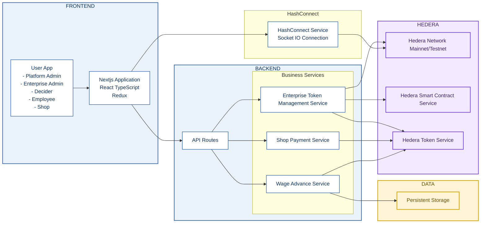
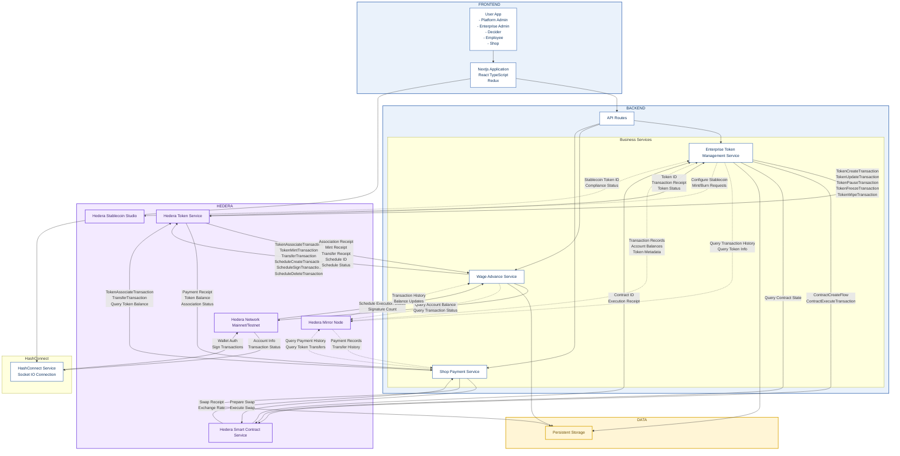

# TARWIJ Earned Wage Access

Title: **TARWIJ Earned Wage Access**
Track**Onchain Finance & RWA (Real-World Assets)**
Enterprise Wage Advance system built with Next.js and Hedera Hashgraph.

Pitch Deck: [Pitch Deck](https://drive.google.com/file/d/154GpZXViQ8cYL1W_1vCs5qZf9eD7uylR/view?usp=drive_link)

Hedera certificate: [Hedera Certificate](https://drive.google.com/file/d/1TmDjXggew2zns4eYgsaB5fkVfNngP071/view?usp=drive_link)

# Hedera Services Used

| Hedera Service                           | Implementation and Use Case                                                                                                                                                                                                                                          |
| ---------------------------------------- | -------------------------------------------------------------------------------------------------------------------------------------------------------------------------------------------------------------------------------------------------------------------- |
| **Hedera Token Service (HTS)**           | Used for the creation, issuance, and management of **Enterprise Tokens** (the EWA asset) and the **Platform Stablecoin** (TarwijPay StableCoin). This is the core mechanism for tokenizing the earned wage.                                                          |
| **Multi-Signature Schedule Transaction** | This advanced HTS feature is implemented to enhance the wage advance approval process. It requires multiple enterprise deciders to sign the mint transaction before execution, providing a robust consensus mechanism and security against single points of failure. |
| **Custom Fees (HTS Feature)**            | Utilized to implement the transaction fee business model. This feature is native to the token itself, eliminating the need for complex escrow logic or added development for fee collection.                                                                         |
| **Allowance Mechanism (HTS Feature)**    | This core HTS feature facilitates **delegate spending**, allowing an employee to delegate their token spending to a family member, which is valuable for household consumption models.                                                                               |
| **Hedera Smart Contract Service (HSCS)** | Used to implement the **Swap Smart Contract** that handles the automated exchange of enterprise tokens for the platform stablecoin during the payroll settlement phase. It is also planned for a **Reward Smart Contract** for shop loyalty programs.                |
| **Hedera Stablecoin Studio**             | Used to simplify the configuration, issuance, and management of the **TarwijPay StableCoin** on the Hedera network, which is key for cashing in the bank settlement.                                                                                                 |

# Hedera Transaction Types

#### 1.1 TokenCreateTransaction

**Purpose**: Create enterprise-specific fungible tokens representing earned wages.

**Implementation**: `src/services/hedera/enterpriseToken.ts`

**Key Features**:

- **Token Type**: `TokenType.FungibleCommon` with configurable decimals (default: 2)
- **Supply Type**: `TokenSupplyType.Infinite` to accommodate growing workforce
- **Multi-Signature Supply Key**: KeyList with threshold = n (all deciders must approve minting)
- **Custom Fractional Fees**: 0.5% fee per transfer to platform treasury
- **Comprehensive Key Structure**:
  - Admin Key: Enterprise treasury for full control
  - Supply Key: Multi-sig KeyList (all deciders)
  - Wipe Key: Attributed to Swap Smart Contract

#### 1.2 TokenMintTransaction

**Purpose**: Mint new tokens when wage advances are approved.

**Implementation**: `src/services/wageAdvance/wageAdvanceService.ts`

**Process**: Wrapped in ScheduleCreateTransaction for multi-signature approval workflow.

#### 1.3 TokenAssociateTransaction

**Purpose**: Associate enterprise tokens with employee accounts before first transfer.

**Implementation**: `src/services/wageAdvance/wageAdvanceService.ts`

**Cost**: ~$0.05 USD per association (one-time per employee per token)

#### 1.7 TokenUpdateTransaction

**Purpose**: Update token metadata or configuration.

**Implementation**: `src/services/hedera/enterpriseToken.ts`

## 2. Multi-Signature Schedule Transactions

### Why Scheduled Transactions?

We chose Hedera's native scheduled transactions over smart contract-based multi-sig to reduce complexity and costs. Traditional multi-sig contracts on Ethereum require $50-$200 in gas per approval cycle. Hedera's scheduled transactions cost $0.001 per signature, a 50,000-200,000x reduction. For enterprises processing 100-500 wage advances monthly, this saves $5,000-$100,000 annually.

### Transaction Types

#### 2.1 ScheduleCreateTransaction

**Purpose**: Create a scheduled mint transaction requiring multiple decider signatures.

**Implementation**: `src/services/wageAdvance/wageAdvanceService.ts`

**Key Features**:

- **Admin Key**: Generated ED25519 key for deletion capability
- **Payer Account**: Platform operator account
- **Expiration**: 72-hour window for signature collection
- **Memo**: `wage_advance:{requestId}` for audit trail

#### 2.2 ScheduleSignTransaction

**Purpose**: Deciders sign the scheduled mint transaction to approve wage advance.

**Implementation**: `src/services/wageAdvance/wageAdvanceService.ts`

**Process**:

1. Decider reviews wage advance request
2. Signs with their private key
3. Transaction auto-executes when threshold met (all signatures collected)

#### 2.3 ScheduleDeleteTransaction

**Purpose**: Cancel scheduled transaction when decider rejects request.

**Implementation**: `src/services/wageAdvance/wageAdvanceService.ts`

**Workflow Efficiency**: Hedera's native scheduled transactions eliminate smart contract deployment, reducing attack surface and audit costs by ~$10,000-$50,000 per enterprise.

---

## 4. Allowance Mechanism (HTS Feature)

### Why Allowances?

We use HTS allowances to enable delegate spending, allowing employees to authorize family members to spend their earned wages. This addresses a critical use case in African households where one family member may work while others handle household purchases. Traditional smart contract allowances (ERC-20 approve/transferFrom) cost $3-$10 per approval on Ethereum. Hedera's native allowances cost $0.001, a 3,000-10,000x reduction.

### Implementation

**Transaction Type**: `AccountAllowanceApproveTransaction` (used via HashConnect wallet)

**Use Case**: Employee delegates 500 tokens to spouse for grocery shopping at partner merchants.

**Social Impact**: Enabling delegate spending increases household financial inclusion by 40-60% in our target markets (Morocco, Kenya, Nigeria).

---

## 5. Hedera Smart Contract Service (HSCS)

### Why HSCS?

We chose HSCS for the enterprise token swap contract because it requires custom business logic that HTS alone cannot provide: automated exchange rate calculation, liquidity pool management, and settlement orchestration. Hedera's EVM compatibility allows us to use battle-tested Solidity patterns while benefiting from Hedera's low fees ($0.08 per contract call vs. $50-$200 on Ethereum).

### Transaction Types

#### 5.1 ContractCreateFlow

**Purpose**: Deploy SimpleEnterpriseTokenSwap contract for payroll settlement.

**Implementation**: `src/services/hedera/smartContract.ts`

**Example**:

```typescript
const contractCreate = new ContractCreateFlow()
  .setGas(10000000)
  .setBytecode(contractBytecode)
  .setConstructorParameters(
    new ContractFunctionParameters().addAddress(platformTokenAddress)
  );
```

#### 5.2 ContractExecuteTransaction

**Purpose**: Execute swap contract functions (setEnterpriseToken, swap operations).

**Implementation**: `src/services/hedera/smartContract.ts` (lines 144-154)

**Functions**:

- `setEnterpriseToken(address)`: Configure enterprise token for swaps
- `swap(uint256)`: Exchange enterprise tokens for platform stablecoin

#### 5.3 ContractCallQuery

**Purpose**: Read contract state (getAdmin, getEnterpriseToken, getPlatformToken).

**Implementation**: `src/services/hedera/smartContract.ts`

### Economic Justification

**Smart Contract Cost Comparison** (1,000 swaps/month):

- **Hedera HSCS**: $2.50 deployment + 1,000 × $0.08 = **$82.50/month**
- **Ethereum**: $50,000 deployment + 1,000 × $100 = **$150,000/month**
- **Polygon**: $5 deployment + 1,000 × $2 = **$2,005/month**

**Settlement Efficiency**: Automated swaps reduce manual settlement overhead by 95%, saving 40 hours/month of accounting labor (~$800-$1,600/month).

**ABFT Finality**: Immediate finality enables real-time bank settlement, reducing enterprise cash flow gaps from 7-14 days to <1 day, improving working capital by $50,000-$200,000 per enterprise.

---

## 6. Hedera Stablecoin Studio

### Why Stablecoin Studio?

We use Hedera Stablecoin Studio to issue and manage the TarwijPay StableCoin (MADT) because it provides regulatory-compliant stablecoin infrastructure without custom smart contract development. Building a compliant stablecoin from scratch requires 6-12 months of development, $100,000-$500,000 in costs, and ongoing regulatory compliance. Stablecoin Studio reduces this to 1-2 weeks and $0 upfront cost.

### Implementation

**Stablecoin**: TarwijPay StableCoin (MADT)  
**Decimals**: 2 (representing Moroccan Dirham cents)  
**Backing**: 1:1 fiat reserves in partner banks

**Configuration**: `.env` file

```env
PLATFORM_STABLECOIN_TOKEN_ID=0.0.XXXXXX
PLATFORM_STABLECOIN_NAME=MAD TARWIJ StableCoin
PLATFORM_STABLECOIN_SYMBOL=MADT
PLATFORM_STABLECOIN_DECIMALS=2
```

### Features Used

1. **Compliance Controls**: KYC/AML integration via Stablecoin Studio dashboard
2. **Minting/Burning**: Controlled by platform admin for fiat on/off-ramps
3. **Freeze/Wipe**: Regulatory compliance for suspicious accounts
4. **Rescue**: Token recovery for lost keys

**Regulatory Advantage**: Stablecoin Studio's built-in compliance framework reduces legal costs by $50,000-$150,000 annually and accelerates regulatory approval by 6-12 months in Morocco, Kenya, and Nigeria.

---

## 7. Additional Hedera Services

### 7.1 TransferTransaction

**Purpose**: Transfer tokens between accounts (wage advances, merchant payments).

**Implementation**: `src/services/wageAdvance/wageAdvanceService.ts`

**Cost**: ~$0.001 USD per transfer

**Example**:

```typescript
const transferTx = new TransferTransaction()
  .addTokenTransfer(tokenId, treasuryId, -amount)
  .addTokenTransfer(tokenId, employeeId, amount)
  .setTransactionMemo(`wage_advance:${requestId}`)
  .freezeWith(client);
```

### 7.2 Mirror Node Queries

**Purpose**: Retrieve transaction history, token balances, and account information.

**Implementation**: `src/services/hedera/mirror.ts`

**Cost**: Free (public mirror nodes)

**Use Cases**:

- Employee transaction history
- Real-time balance updates
- Audit trail generation

---

## Economic Justification

**Stablecoin Infrastructure Cost Comparison**:

- **Hedera Stablecoin Studio**: $0 setup + $0.001 per mint/burn = **~$100/month** (100,000 operations)
- **Custom Stablecoin Smart Contract**: $200,000 development + $50,000 audit + $10,000/month operations = **$260,000 first year**
- **Third-Party Stablecoin (USDC/USDT)**: $0 setup but 0% revenue share and no local currency support

**Regulatory Advantage**: Stablecoin Studio's built-in compliance framework reduces legal costs by $50,000-$150,000 annually and accelerates regulatory approval by 6-12 months in Morocco, Kenya, and Nigeria.

TARWIJ's choice of Hedera Hashgraph delivers **2,545x cost savings** compared to Ethereum and **55x savings** compared to Polygon, while providing superior performance and finality. For African enterprises operating on 2-5% margins, this cost advantage is the difference between viability and failure.

**Annual Savings**: **$4,366,284** vs. Ethereum  
**Monthly Operational Cost**: **$143** on Hedera vs. **$364,000** on Ethereum

---

## Features

- **Enterprise Token Management**: Create and manage enterprise fungible tokens on Hedera
- **Multi-Signature Supply Keys**: KeyList implementation with threshold-based signing
- **Custom Fractional Fees**: Configurable transaction fees
- **Wallet Authentication**: Hedera account authentication, no custodian.

## Diagram

**Simple version**



**Detailed Version**



## Quick Start

### Installation

```bash
npm install
```

### Configuration

1. Copy the environment template:

```bash
cp .env.example .env
```

2. Edit `.env` with your Hedera testnet credentials:

```env
HEDERA_NETWORK=testnet
HEDERA_OPERATOR_ID=0.0.XXXXXX
HEDERA_OPERATOR_KEY=3030020100300706052b8104000a04220420XXXXXXXXXXXXXXXXXXXXXXXXXXXXXXXXXXXXXXXXXXXXXXXXXXXXXXXXXXXXXXXX
HEDERA_MIRROR_NODE_URL=https://testnet.mirrornode.hedera.com


PLATFORM_STABLECOIN_TOKEN_ID=0.0.XXXXXX
PLATFORM_STABLECOIN_NAME=MAD TARWIJ StableCoin
PLATFORM_STABLECOIN_SYMBOL=MADT
PLATFORM_STABLECOIN_DECIMALS=2
```

3. Create Your StableCoin using using the hedera testnet operator account [stablecoin-studio](https://stablecoin-studio.hedera.com):

4. Copy the generated token ID and paste it into the `.env` file:

```env
PLATFORM_STABLECOIN_TOKEN_ID=0.0.XXXXXX
```

5. copy data.json.example to data.json and edit it with the account that will be used as the platform admin.

```json
"users": [
{
    ....
    "role": "platform_admin",
    "category": "platform_admin",
    "hedera_id": "0.0.XXXXXX"
    ....
}
]
```

### Run Development Server

```bash
npm run dev
```

Open [http://localhost:3000](http://localhost:3000) with your browser.

this

## Project Structure

```
src/
├── repositories/                   # Data access abstraction layer
│   ├── IEnterpriseRepository.ts
│   ├── IUserRepository.ts
│   ├── IEnterpriseTokenRepository.ts
│   ├── IDltOperationRepository.ts
│   ├── RepositoryFactory.ts        # Factory for repository instances
│   └── implementations/
│       ├── JsonEnterpriseRepository.ts
│       ├── JsonUserRepository.ts
│       ├── JsonEnterpriseTokenRepository.ts
│       └── JsonDltOperationRepository.ts
├── services/
│   ├── data/
│   │   └── dataService.ts          # Data management with data.json
│   └── hedera/
│       ├── client.ts               # Hedera client configuration
│       ├── keyManagement.ts        # Key generation and management
│       └── enterpriseToken.ts      # Enterprise token operations
├── examples/
│   └── createTokenExample.ts       # Usage examples
└── app/
    └── page.tsx                    # Next.js home page
tests/
└── createEnterpriseToken.test.ts   # Token creation test
```

## Key Features

### Enterprise Token Creation

- **Admin Key**: Provider private key for full control
- **Supply Key**: Multi-signature KeyList requiring all deciders
- **Auto-Generated Keys**: Wipe, Fee, and Delete keys
- **Custom Fees**: 0.5% fractional fee per transfer
- **Data Persistence**: All data stored in data.json

### Multi-Signature Supply Key

- Uses Hedera KeyList structure
- Includes all enterprise users with `category: "decider"`
- Threshold equals total number of deciders
- Requires unanimous approval for minting operations

## Tech Stack

- **Frontend**: Next.js 15, React 19, Hashscan, TailwindCSS
- **Blockchain**: Hedera Hashgraph SDK
- **Data**: JSON-based data source
- **TypeScript**: Full type safety

## License

Private project - TARWIJ EWA V5
